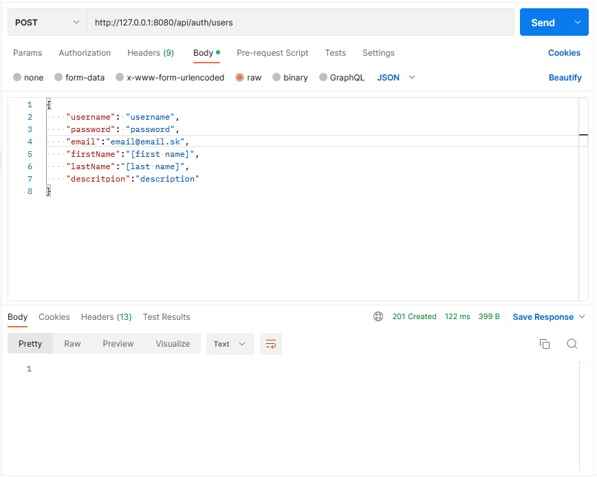
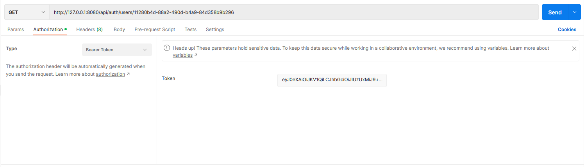

[<< Return to documentation overview](README.md)

[>> Go to Java backend repository](https://github.com/ASICDE/asicde-backend)

# Setting up Java backend testing enviroment (without Docker)

## Prerequisites
1. Make sure that you have already install all prerequisites for running Java backend without Docker and that you are able to run backend application. 
    - [>> Show me how to run Java backend without Docker](asicde-backend.md)
2. Download, install and run [Postman](https://www.postman.com/downloads/)
    - **Important:** without installed version you can't test requests to localhost 

## Creating request

### Creating new user
By default, there is empty database. We must create user to make other requests:

1. [Create new request in Postman](https://learning.postman.com/docs/sending-requests/requests/) 
2. Creating new testing user:
    - Backend is running on port 8080 on localhost:
        1. Use `http://127.0.0.1:8080/api/auth/users` as URL
        2. **Important:** select method POST 
        3. Fill Body with raw -> JSON information about new user:
            ```json
            {
                "username": "username",
                "password": "password",
                "email":"email@email.sk",
                "firstName":"[first name]",
                "lastName":"[last name]",
                "descritpion":"description"
            }
            ```
        4. Send request:
            - Should return `201 Created`
            
        5. Check created user in DB:
            - database asicde -> schema core -> tables -> user

## Authorization

### Get Bearer token
Application is using Bearer token for authorization. To get token you have to login created user first:

1. Send GET request to `http://127.0.0.1:8080/api/auth/login` with JSON body:
    ```json
    {
        "username": "username",
        "password": "password"
    }
    ```
2. After successful login you receive token in JSON response body as string with key `"token"`:
    - copy and save token, it will be used in following requests
        
### Send request with authorization token
To get information about user, authorization is required. Use URL: `http://127.0.0.1:8080/api/auth/users/{uuid}`, user has unique `uuid`, you can find it in the database or in the response after login.

1. Set Bearer token in authorization tab in Postman (paste from login respone).
    
2. Send GET request `http://127.0.0.1:8080/api/auth/users/{uuid}`
3. JSON response should contain multiple parameters about user. 

# Testing API
Use Postman for testing backend API. [>> Show me ASICDE API](#asicde-api.md)