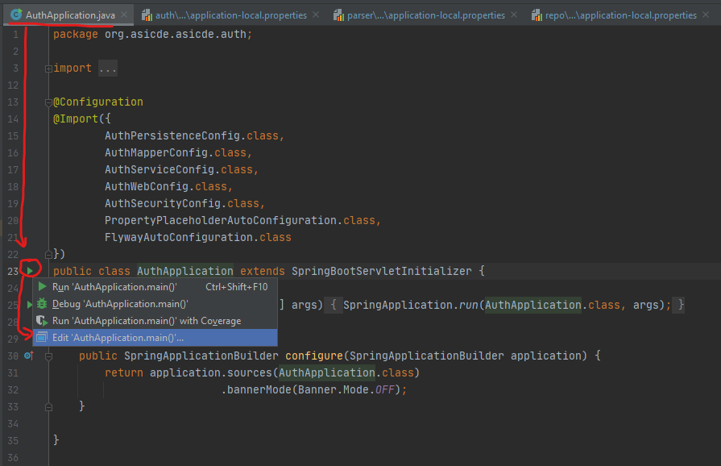
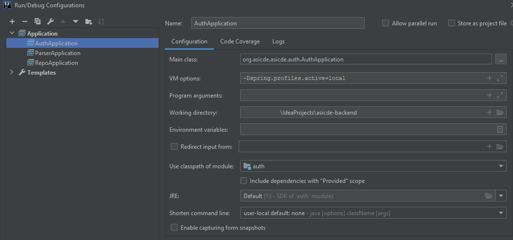
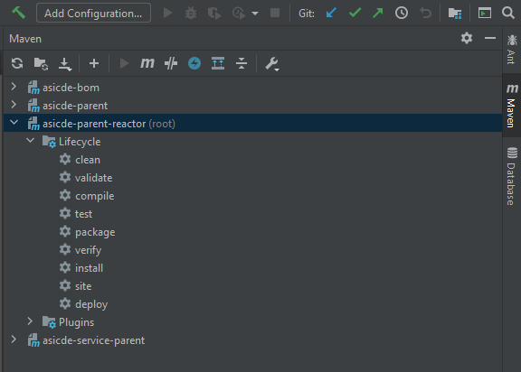
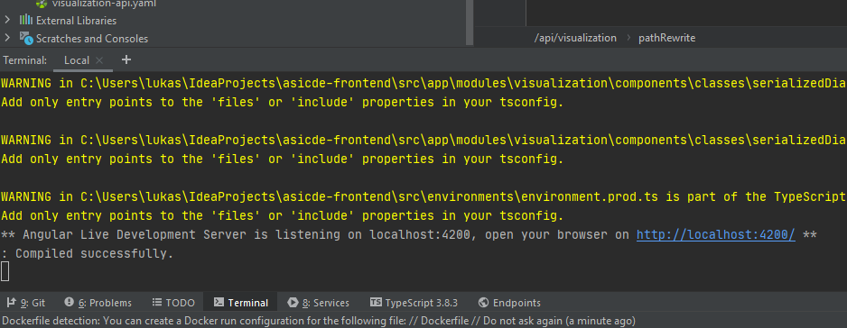

[<< Return to documentation overview](README.md)

# Setting up a development environment

This document describes the process of setting up a development environment for the ASICDE project.

Table of Contents
=================

   * [Setting up a development environment](#setting-up-a-development-environment)
      * [Setting up development environment for backend](#setting-up-development-environment-for-backend)
         * [Prerequisites](#prerequisites)
            * [Setup JDK 13](#setup-jdk-13)
            * [Setup Maven](#setup-maven)
         * [Clone backend repositories](#clone-backend-repositories)
         * [Using IntelliJ IDEA for backend projects](#using-intellij-idea-for-backend-projects)
         * [Setup local database, frontend and service orchestrator](#setup-local-database-frontend-and-service-orchestrator)
      * [Setting up development environment for frontend](#setting-up-development-environment-for-frontend)
         * [Prerequisites](#prerequisites-1)
         * [Setup Visual Studio Code](#setup-visual-studio-code)
         * [Clone frontend and docker repository](#clone-frontend-and-docker-repository)
         * [Start the backend](#start-the-backend)
         * [Using Visual Studio Code](#using-visual-studio-code)
         * [Using IntelliJ IDEA for frontend project execution](#using-intellij-idea-for-frontend-project-execution)

## Setting up development environment for backend

### Prerequisites

- [Maven](http://maven.apache.org/)
- [Oracle JDK 13](https://www.oracle.com/java/technologies/javase-jdk13-downloads.html)
- [Intellij Idea](https://www.jetbrains.com/idea/)
- [Git](https://git-scm.com/)
- [Docker](https://www.docker.com/)

#### Setup JDK 13

- Download the installation package for your desired operating system
- Install the JDK
- [Set environment variable](https://www.architectryan.com/2018/08/31/how-to-change-environment-variables-on-windows-10/) for `JAVA_HOME` to point to the base installation directory
  - In Windows, e.g.: `C:\Program Files\Java\jdk-13.0.2`
  - In Linux, e.g.: `/usr/lib/jvm/jdk-13.0.2/`
- Add Java to your `PATH` environment variable
  - In Windows, e.g.: `C:\Program Files\Java\jdk-13.0.2\bin`
  - In Linux, e.g.: `/usr/lib/jvm/jdk-13.0.2/bin`

#### Setup Maven
- Download the package containing compiled binary files for your desired operating system
- Extract the package
- Set environment variables for `M2_HOME` and `MAVEN_HOME` to point to the base installation directory
  - In Windows, e.g.: `C:\apache-maven-3.6.3`
  - In Linux, e.g.: `/opt/apache-maven-3.6.3`
- Add Maven to your `PATH` environment variable
  - In Windows, e.g.: `C:\apache-maven-3.6.3\bin`
  - In Linux, e.g.: `/opt/apache-maven-3.6.3/bin`

### Clone backend repositories

It is advised to create one folder as your workspace, where you will clone all of the project repositories, so let's create it.

```bash
mkdir ASICDE
cd ASICDE
```

Now clone all backend repositories:

```bash
git clone -b dev git@github.com:ASICDE/asicde-parent.git
git clone -b dev git@github.com:ASICDE/asicde-api.git
git clone -b dev git@github.com:ASICDE/asicde-backend.git
```

All repositories have been cloned by using the `dev` branch which is dedicated for project development and holds the latest versions of the code.

### Using IntelliJ IDEA for backend projects

- We strongly recommend using IntelliJ IDEA for further project development, as it integrates every important technology used in the project, namely Maven, Spring Boot, Angular and more.
  - Ideally, you should have the latest IDEA (2020.2.3) Ultimate installed.
- In order to run the Spring Boot projects, you first need to install projects using Maven in the following order:
  1. [parent](https://github.com/ASICDE/asicde-parent/)
  2. [api](https://github.com/ASICDE/asicde-api)
  3. [backend](https://github.com/ASICDE/asicde-backend)
  See guide for installing project with Maven below.
  
- After installing each project, you should be able to run Spring Boot application as follows:
  1. Locate the executable application file for each of the services (`AuthApplication`, `ParserApplication` and `RepoApplication`) and create a Run configuration as shown in the picture.
     
     
    - set this as your VM variable: `-Dspring.profiles.active=local`. This command sets the Spring Boot profile of the whole configuration (in this case, we use `local` profile which is located in: `/<module>/src/main/resources/application-local.properties`).
    
  2. Execute the created run configuration.


- To install the project dependencies using Maven, you need to follow these steps:
  - Open Maven tab in the side menu and select the project with (root) label.
  - Select Lifecycle goals `clean` and `install`
    
  - Run the selected goals using `Run Maven Build` button.
  - The IDE should automatically open a console window, indicating the build status and results.
  
For an overview of the project module structure and detailed documentation, please refer to each repository's Readme file ([parent](https://github.com/ASICDE/asicde-parent/blob/master/README.md), [api](https://github.com/ASICDE/asicde-api/blob/master/README.md), [backend](https://github.com/ASICDE/asicde-backend/blob/master/README.md)).

### Setup local database, frontend and service orchestrator

In order to test the backend you can use Postman or other REST API client. The other option is to create an instance of the frontend with the custom orchestrator (router) to tell the frontend to use individual applications running in Intellij IDEA.

Clone repositories for local Docker development stack:

```bash
git clone -b dev git@github.com:ASICDE/asicde-docker-dev.git
```

This stack will contain PostgreSQL database that is required by the backend, together with an instance of the frontend and a custom router. To set individual backend module IP addresses and ports, open `docker-compose.yml` and change the host configuration for the router service:

```
  router:
    environment:
      AUTH_HOST: "http\\:\\/\\/host.docker.internal\\:8080"
      PARSER_HOST: "http\\:\\/\\/host.docker.internal\\:8081"
      REPO_HOST: "http\\:\\/\\/host.docker.internal\\:8082"
```

Each module has the option to be configured for individual IP addresses and ports. You can find more information about the local development stack in the [asicde-docker-dev repository](https://github.com/ASICDE/asicde-docker-dev).

## Setting up development environment for frontend 

### Prerequisites

- [NodeJS](https://nodejs.org/en/)
- NPM - usually packaged together with NodeJS
- [Docker](https://www.docker.com/)
- [Visual Studio Code](https://code.visualstudio.com/)

### Setup Visual Studio Code

Install the following plugins to help you develop in Angular & NodeJS:
- Prettier
- HTML CSS Support
- DotENV
- Path Intellisense
- *(Optional)* Bracket Pair Colorizer 2
- *(Optional)* Material Icon Theme
- *(Optional)* Markdown All in One
- *(Optional)* Markdown Preview Enhanced

### Clone frontend and docker repository

```bash
git clone -b dev git@github.com:ASICDE/asicde-frontend.git
git clone git@github.com:ASICDE/asicde-docker.git
```

Frontend has been cloned by using the `dev` branch which is dedicated for project development and holds the latest versions of the code.

### Start the backend

In order to work on the frontend, you need to have a backend service to serve your API requests. For this purpose, you should clone the docker repository holding docker-compose stack configuration and start it locally. 

To have the latest version of the backend services, you can rename `docker-compose.dev.yml` to `docker-compose.yml` (or rename it to `docker-compose.override.yml` if you do not want to overwrite the original file). Although these versions may not be 100% stable.

The backend should be already configured to have it's own database and the orchestrator service running locally on port `10000`, so no extra modifications are needed.

```bash
cd asicde-docker
docker-compose up -d
```

### Using Visual Studio Code

As a reference for the project structure, please refer to the repository's [Readme file](https://github.com/ASICDE/asicde-frontend/blob/master/README.md).

### Using IntelliJ IDEA for frontend project execution

In case you want to run the Angular project in connection with manually executed Spring Boot project, you can use following guide to run the frontend application.

- Open terminal in the frontend project root (where the `package.json` file is located)
- Run `npm install && npm start` commands

- Application should be available at port 4200 by default.
