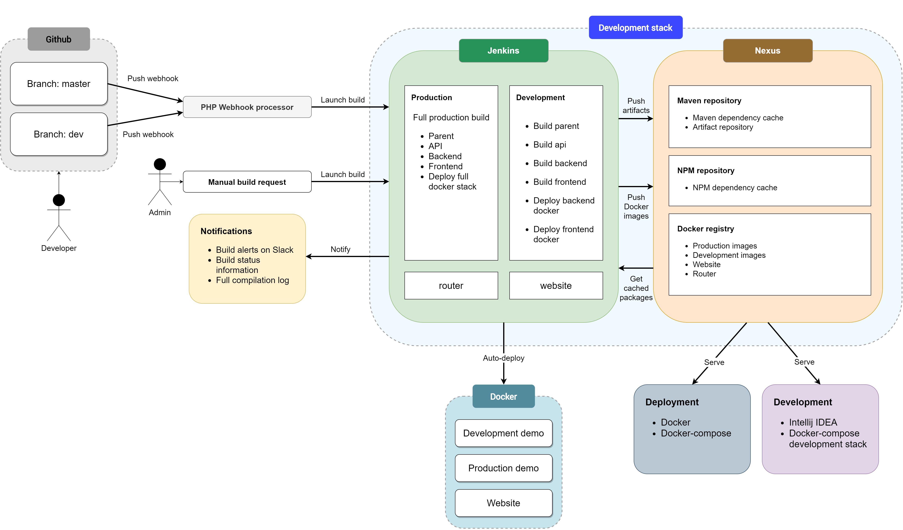

# Development lifecycle

Table of Contents
=================

   * [Development lifecycle](#development-lifecycle)
      * [Git branch lifecycle](#git-branch-lifecycle)
      * [Manual build triggers](#manual-build-triggers)
      * [Jenkins auto-building and deployment](#jenkins-auto-building-and-deployment)
      * [Sonatype Nexus](#sonatype-nexus)
      * [Deployment using Docker](#deployment-using-docker)

The following diagram depicts the development lifecycle used in this project:

## Git branch lifecycle

The diagram above displays two distinct branches in the Github repositories. These are the main branches that will always be available.

- The `master` branch is where production-ready code is stored. New changes can be added by creating a pull request and merging the `dev` branch into `master`.
- The `dev` branch consists of development versions of the code. This code is not yet fully tested with the rest of the application and can still contain bugs.
- Other than the standard two branches, which are built automatically and deployed to be tested, multiple additional branches can exist that hold new code for certain features, bugfixes, hotfixes and code refactorization. These branches have special naming schemes described below:
  - `feature/<sprintNum>-<story/task-id>/<description>`
    - a branch derived from `dev`, that holds code for new features
  - `fix/<sprintNum>-<task-id>/<description>`
    - a branch derived from `dev`, that holds code for general bugfixes
  - `hotfix/<sprintNum>-<task-id>/<description>`
    - a branch derived from `master`, that holds code for hotfixes - when a critical bug is discovered in the production-ready code
  - `refactor/<sprintNum>-<task-id>/<description>`
    - a branch derived from `dev`, that holds revisions of the current code with optimization and refactorization in mind

Derived branches have only a short lifetime which lasts from the begining of the task and ends when the task is complete and ready for testing.

When code is pushed or merged into either `master` or `dev` branch, a webhook is created that is caught by the PHP webhook processor. This small piece of code then processes the webhook notification from Github and executes a certain task. The development branches have their own build tasks in Jenkins (for each module). Each module is built according to the webhook notification and any addditional dependent modules are also rebuilt to apply any changes introduced into the parent module. All of the production branches trigger the full production build and deployment.

Two repositories are separate from this chain: `router` and `website`. These two repositories are built separately and are not dependent on any other module. The `website` repository is built and then deployed and served as the main website for this project.

## Manual build triggers

Any of the Jenkins build tasks can also be triggered manually. This is useful when dealing with issues in the configuration or the need to manually refresh the Docker images or Maven artifacts which are built.

## Jenkins auto-building and deployment

Jenkins is a service that can be used to automatically build an application, run commands or do any other tasks that can be automated. In our case, we use Jenkins to build our project modules and services without user interaction and report the status of the build.

You can find more information about how Jenkins is used in the [auto-build and deployment](auto-deployment.md) guide.

After each build is complete, either with an error or with a successful end, a notification is then sent to our development team. This feature is importat as when a build fails, the authors of latest changes can look over what has happened, and promptly fix the issues. The notification provides a URL for the build log with detailed information.

## Sonatype Nexus

Nexus is a service that combines different types of repositories for Docker, NPM, Maven or other into one platform. We use Nexus as a cache and storage for our build outputs. Nexus is also used to serve Docker images to anyone and Maven artifacts to the development team - this greatly decreases the time needed to build project modules independently as only a portion of the code needs to be built locally and the rest is served using the Internet.

## Deployment using Docker

We use Docker as the platform of choice for quick and easy deployment of any application. Docker uses containers which are isolated pieces of code running on the target platform, which does not need to match the container's inner operating system and platform.

Each module of the project and also the website are designed to be hosted inside of a Docker container. This makes the whole project very easy to set-up and deploy on any platform of choice. Using Jenkins, we also [automatically deploy the Docker containers](auto-deployment.md) produced in the build tasks to continuously serve the lates versions of the applications.
