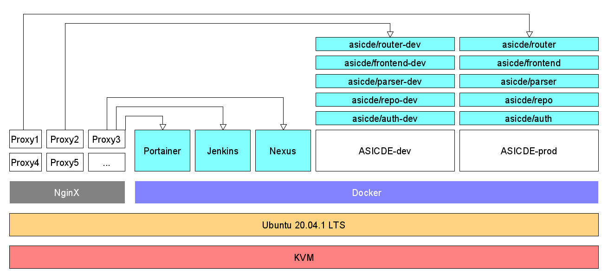

# Installation guide for the development stack

Table of Contents
=================

   * [Installation guide for the development stack](#installation-guide-for-the-development-stack)
   * [Table of Contents](#table-of-contents)
      * [1. Preparation](#1-preparation)
         * [Updating the Ubuntu installation](#updating-the-ubuntu-installation)
         * [Installing required packages](#installing-required-packages)
         * [Desired architecture](#desired-architecture)
      * [2. Setup your data disk](#2-setup-your-data-disk)
      * [3. Setup Acme.sh for issuing Let's Encrypt certificates](#3-setup-acmesh-for-issuing-lets-encrypt-certificates)
      * [4. Setting up your webserver](#4-setting-up-your-webserver)
         * [Increase request size limit](#increase-request-size-limit)
         * [Create custom configuration files for repetitive tasks](#create-custom-configuration-files-for-repetitive-tasks)
            * [Default virtual host configuration](#default-virtual-host-configuration)
            * [Logging configuration](#logging-configuration)
            * [PHP configuration](#php-configuration)
            * [Permanent redirect from HTTP to HTTPS](#permanent-redirect-from-http-to-https)
            * [Permanent redirect from non-www to www](#permanent-redirect-from-non-www-to-www)
            * [SSL configuration for main domain](#ssl-configuration-for-main-domain)
            * [SSL configuration for custom domain](#ssl-configuration-for-custom-domain)
         * [Create your virtual host config](#create-your-virtual-host-config)
            * [Setup a main configuration file for the domain name:](#setup-a-main-configuration-file-for-the-domain-name)
            * [Create configuration files for any subdomains (for example www - root domain):](#create-configuration-files-for-any-subdomains-for-example-www---root-domain)
            * [Create a new main config for additional custom domains:](#create-a-new-main-config-for-additional-custom-domains)
            * [An example of a Proxy subdomain configuration:](#an-example-of-a-proxy-subdomain-configuration)
      * [5. Setup Postfix](#5-setup-postfix)
      * [6. Setup Dovecot](#6-setup-dovecot)
      * [7. Setup Portainer](#7-setup-portainer)
         * [Configure docker](#configure-docker)
         * [Start Portainer](#start-portainer)
         * [Configure NginX proxy for Portainer](#configure-nginx-proxy-for-portainer)
         * [Portainer configuration](#portainer-configuration)
      * [8. Setup Sonatype Nexus](#8-setup-sonatype-nexus)
         * [Configure NginX proxy for Nexus](#configure-nginx-proxy-for-nexus)
         * [Configure Nexus](#configure-nexus)
         * [Configure NginX proxy for Nexus Docker registry](#configure-nginx-proxy-for-nexus-docker-registry)
      * [9. Setup Jenkins](#9-setup-jenkins)
         * [Configure NginX proxy for Jenkins](#configure-nginx-proxy-for-jenkins)
         * [Jenkins configuration](#jenkins-configuration)
         * [Global tool configuration](#global-tool-configuration)
            * [JDK](#jdk)
            * [Maven](#maven)
            * [NodeJS](#nodejs)
            * [Docker](#docker)
         * [Maven configuration](#maven-configuration)
         * [NPM configuration](#npm-configuration)
         * [Setting up credentials](#setting-up-credentials)
            * [Github SSH access](#github-ssh-access)
            * [Nexus access](#nexus-access)
            * [<em>(Optional)</em> Slack access](#optional-slack-access)
      * [10. Setup Jenkins pipelines](#10-setup-jenkins-pipelines)

## 1. Preparation
- Configure SSH keys for you VM to enable remote access
- Download and install Putty (on Windows) SSH client

### Updating the Ubuntu installation

Connect to your Ubuntu VM and update the system

- `sudo su`
- `apt update`
- `apt upgrade -y`
- `do-release-upgrade`
  - Keep local versions of configs
  - Remove old packages
  - Reboot

### Installing required packages

We need to install some packages in order to be able to configure the development stack. A rundown of the packages is listed below:

- git: Commandline tool for git repository management
- *(Optional)* mc: Midnight commander - a visual interface for browsing through directory structures (with many useful features)
- wget: Commandline tool for downloading files
- docker: Service for Docker container deployment and management
- docker-compose: Commandline tool for working with Docker container stacks
- nginx: Web server and HTTP/HTTPS/WS/WSS proxy
- php-fpm: PHP file interpretter for integration with Nginx
- *(Optional)* postfix: SMTP mail server
- *(Optional)* dovecot-imapd: IMAP mail server
- *(Optional)* htop: Utility to monitor system resources
- zip & unzip: Utilities for file compression and decompression

`apt install git mc wget htop zip unzip docker docker-compose nginx php-fpm postfix dovecot-imapd`
  - Postifx configuration: Internet site

### Desired architecture



## 2. Setup your data disk

Your VM should come with a separate data disk. This disk isn't formatted or mounted by default.

To find out if you have an additional disk run `lsblk`:
```
NAME    MAJ:MIN RM  SIZE RO TYPE MOUNTPOINT
loop0     7:0    0 55.3M  1 loop /snap/core18/1885
loop1     7:1    0 70.6M  1 loop /snap/lxd/16922
loop2     7:2    0 30.3M  1 loop /snap/snapd/9279
vda     252:0    0   10G  0 disk
├─vda1  252:1    0  9.9G  0 part /
├─vda14 252:14   0    4M  0 part
└─vda15 252:15   0  106M  0 part /boot/efi
vdb     252:16   0   75G  0 disk
```
From the output above you can clearly see, that the VM has two disks, one named `vda` and the other named `vdb`. The first disk contains your Ubuntu installation and the second one is not formatted.

To set-up the second disk we first need to create a new partition table `cfdisk /dev/vdb`:
- Select partition scheme as `GPT`
- Select the Empty space and press New partition button
- Create a primary partition with the maximum size
- As partition type select `Linux`
- Press quit and save changes

The partition is now set-up but we still need to format it: `mkfs.ext4 /dev/vdb1`.

To auto-mount the partition create a new directory in the root of your filesystem `mkdir /data` and open fstab `vim /etc/fstab`:
```
# Data disk
/dev/vdb1                       /data                   ext4    defaults        0       0
```
Save the file and now you can mount the new disk to your VM with `mount -a`.

## 3. Setup Acme.sh for issuing Let's Encrypt certificates

Acme.sh script is used to generate SSL certificates for our web server and mail server.

- `curl https://get.acme.sh | sh`
- `cd /root/.acme.sh/`
- `mkdir /etc/nginx/certs`

Now you can issue a certificate for your domain:
```bash
./acme.sh --issue -d team01-20.studenti.fiit.stuba.sk \
                  -w /var/www/html/ \
                  --cert-file /etc/nginx/certs/team01-20.studenti.fiit.stuba.sk/cert.cer \
                  --key-file /etc/nginx/certs/team01-20.studenti.fiit.stuba.sk/key.key \
                  --fullchain-file /etc/nginx/certs/team01-20.studenti.fiit.stuba.sk/fullchain.cer
```

This command will issue a certificate with the use of our NginX server. By default all domains pointing to the VM will use the website in the webroot `/var/www/html/`. We tell the `acme.sh` script where to store the domain verification files, then where to output the certificate files themselves.

## 4. Setting up your webserver

- Create an SSL certificate with Let's Encrypt (use step above for all domains)
- Create a new directory in /etc/nginx/ for custom configuration files: `mkdir /etc/nginx/conf`

The folder structure will look like this:
```
/etc/nginx
  ./certs                                                         | SSL certificates for domains
    ./{domain1}                                                   | SSL certificates for domain1
      fullchain.cer                                               | SSL fullchain certificate
      key.key                                                     | SSL certificate key
    ./{domain2}                                                   | SSL certificates for domain2
      fullchain.cer                                               | SSL fullchain certificate
      key.key                                                     | SSL certificate key
    ...
  ./conf                                                          | custom configuration directory
    default.conf                                                  | default virtual host configuration
    logging.conf                                                  | logging configuration
    php.conf                                                      | PHP configuration
    redirect_https.conf                                           | redirect rule HTTP to HTTPS
    redirect_www.conf                                             | redirect rule non-www to www
    ssl_{domain1}.conf                                            | SSL config for domain
    ssl_{domain2}.conf                                            | SSL config for domain
    ...
  ./conf.d                                                        | NginX additional global configuration
  ./modules-available                                             | NginX available modules
  ./modules-enabled                                               | NginX enabled modules
  ./sites-available                                               | NginX available sites configs
    ./{domain1}                                                   | domain config folder
      proxy.subdomain.conf                                        | subdomain config
      subdomain.conf                                              | subdomain config
      www.conf                                                    | subdomain config
      ...
    ./{domain2}                                                   | domain config folder
      www.conf                                                    | subdomain config
    {domain1}.conf                                                | main domain name configuration
    {domain2}.conf                                                | main domain name configuration
  ./sites-enabled                                                 | NginX enabled sites configs
    {domain1}.conf -> /etc/nginx/sites-available/{domain1}.conf   | linked domain config
    {domain2}.conf -> /etc/nginx/sites-available/{domain2}.conf   | linked domain config
  ./snippets                                                      | NginX snippets
  fastcgi.conf
  fastcgi_params
  koi-utf
  koi-win
  mime.types
  nginx.conf                                                      | main NginX configuration
  proxy_params
  scgi_params
  uwsgi_params
  win-utf
```

### Increase request size limit

Create a new configuration file for request size `vim /etc/nginx/conf.d/request_size.conf`:
```apacheconf
client_max_body_size 1G;
```

### Create custom configuration files for repetitive tasks

#### Default virtual host configuration
- `vim /etc/nginx/conf/default.conf`
  ```apacheconf
  index index.php index.html;

  location ~ /\.ht {
    deny all;
  }
  ```

#### Logging configuration
- `vim /etc/nginx/conf/logging.conf`
  ```apacheconf
  access_log /data/logs/nginx_access.log;
  error_log /data/logs/nginx_error.log warn;
  ```

#### PHP configuration
- `vim /etc/nginx/conf/php.conf`
  ```apacheconf
  location ~ \.php$ {
    try_files $uri =404;
    fastcgi_split_path_info ^(.+?\.php)(/.*)$;
    include fastcgi_params;
    fastcgi_param SCRIPT_FILENAME $document_root$fastcgi_script_name;
    fastcgi_param PATH_INFO $fastcgi_path_info;
    fastcgi_param HTTPS on;
    #Avoid sending the security headers twice
    fastcgi_param modHeadersAvailable true;
    fastcgi_param front_controller_active true;
    fastcgi_pass unix:/run/php/php7.4-fpm.sock;
    fastcgi_intercept_errors on;
    fastcgi_request_buffering off;
  }
  ```

#### Permanent redirect from HTTP to HTTPS
- `vim /etc/nginx/conf/redirect_https.conf`
  ```apacheconf
  return 301 https://$host$request_uri;
  ```

#### Permanent redirect from non-www to www
- `vim /etc/nginx/conf/redirect_www.conf`
  ```apacheconf
  return 301 https://www.$host$request_uri;
  ```

#### SSL configuration for main domain
- `vim /etc/nginx/conf/ssl_team01-20.studenti.fiit.stuba.sk.conf`
  ```apacheconf
  ssl_certificate /etc/nginx/certs/team01-20.studenti.fiit.stuba.sk/fullchain.cer;
  ssl_certificate_key /etc/nginx/certs/team01-20.studenti.fiit.stuba.sk/key.key;
  ssl_stapling on;
  ```

#### SSL configuration for custom domain
- `vim /etc/nginx/conf/ssl_asicde.org.conf`
  ```apacheconf
  ssl_certificate /etc/nginx/certs/asicde.org/fullchain.cer;
  ssl_certificate_key /etc/nginx/certs/asicde.org/key.key;
  ssl_stapling on;
  ```

### Create your virtual host config

In order to server a web site to the user, you need to define a virtual host configuration that tells the NginX server how to handle incomming connections from your domain name.

#### Setup a main configuration file for the domain name:
- `mkdir /etc/nginx/sites-available/team01-20.studenti.fiit.stuba.sk`
- `vim /etc/nginx/sites-available/team01-20.studenti.fiit.stuba.sk.conf`
  ```apacheconf
  # Virtual Host: team01-20.studenti.fiit.stuba.sk

  # redirect to https
  server {
    listen 80;
    server_name team01-20.studenti.fiit.stuba.sk;

    include /etc/nginx/conf/redirect_https.conf;
    include /etc/nginx/conf/logging.conf;
  }

  include /etc/nginx/sites-available/team01-20.studenti.fiit.stuba.sk/*.conf;
  ```

#### Create configuration files for any subdomains (for example www - root domain):
- `vim /etc/nginx/sites-available/team01-20.studenti.fiit.stuba.sk/www.conf`
  ```apacheconf
  # Virtual Host: team01-20.studenti.fiit.stuba.sk

  server {
    listen 443 ssl http2;
    server_name team01-20.studenti.fiit.stuba.sk;

    # where files are located for this subdomain
    root /data/www/team01-20.studenti.fiit.stuba.sk/www/;

    include /etc/nginx/conf/default.conf;
    include /etc/nginx/conf/ssl_team01-20.studenti.fiit.stuba.sk.conf;
    include /etc/nginx/conf/php.conf;
    include /etc/nginx/conf/logging.conf;
  }
  ```

#### Create a new main config for additional custom domains:
- `mkdir /etc/nginx/sites-available/asicde.org`
- `vim /etc/nginx/sites-available/asicde.org.conf`
  ```apacheconf
  # Virtual Host: asicde.org

  # redirect to www
  server {
    listen 80;
    server_name asicde.org;

    include /etc/nginx/conf/redirect_www.conf;
    include /etc/nginx/conf/logging.conf;
  }
  server {
    listen 443 ssl http2;
    server_name asicde.org;

    include /etc/nginx/conf/ssl_asicde.org.conf;
    include /etc/nginx/conf/redirect_www.conf;
    include /etc/nginx/conf/logging.conf;
  }

  # redirect to https
  server {
    listen 80;
    server_name *.asicde.org;

    include /etc/nginx/conf/redirect_https.conf;
    include /etc/nginx/conf/logging.conf;
  }

  include /etc/nginx/sites-available/asicde.org/*.conf;
  ```

#### An example of a Proxy subdomain configuration:
- `vim /etc/nginx/sites-available/asicde.org/proxy.dockerhub.conf`
  ```apacheconf
  # Virtual Host: hub.asicde.org

  server {
    listen 443 ssl http2;

    server_name hub.asicde.org;

    chunked_transfer_encoding on;

    # a default website
    location / {
      root /data/www/default/;
    }

    location /v2/ {
      proxy_pass http://localhost:8082/v2/;
      add_header 'Docker-Distribution-Api-Version' 'registry/2.0' always;
      proxy_set_header Host $host;
      proxy_set_header X-Real-IP $remote_addr;
      proxy_set_header X-Forwarded-For $proxy_add_x_forwarded_for;
      proxy_set_header X-Forwarded-Proto 'https';
    }

    include /etc/nginx/conf/ssl_asicde.org.conf;
    include /etc/nginx/conf/logging.conf;

  }
  ```

**To enable a domain name, you need to link the configuration to enabled sites and reload NginX:**
- `ln -s /etc/nginx/sites-available/team01-20.studenti.fiit.stuba.sk.conf /etc/nginx/sites-enabled/team01-20.studenti.fiit.stuba.sk.conf`
- `ln -s /etc/nginx/sites-available/asicde.org.conf /etc/nginx/sites-enabled/asicde.org.conf`
- `mkdir /data/logs`
- `chown www-data:www-data /data/logs`
- `chown -R root:www-data /etc/nginx/`
- `systemctl enable --now php7.4-fpm`
- `systemctl reload nginx`
- *Note: Subdomains are included automatically - see configuration for a custom domain*

## 5. Setup Postfix
TODO

## 6. Setup Dovecot
TODO

## 7. Setup Portainer

Portainer is a tool for management of Docker containers and other components. It provides a web interface which is easy to navigate and user-friendly.

### Configure docker

First we need to stop Docker and change the storage location for Docker volumes. Stop Docker with `systemctl stop docker`.

Now create a new directory called `docker` in the `/data` directory and add the entry below into `/etc/fstab`:
```
# Docker data bind mount
/data/docker                    /var/lib/docker         none    bind            0       0
```

Refresh mounts with `mount -a` and start docker again `systemctl start docker`.

### Start Portainer

```bash
docker volume create portainer_data
docker run -d -p 9000:9000 \
              --name=portainer \
              --restart=always \
              -v /var/run/docker.sock:/var/run/docker.sock \
              -v portainer_data:/data portainer/portainer-ce
```

### Configure NginX proxy for Portainer

Create a configuration for new subdomain in the NginX sites-available directory:
- `vim /etc/nginx/sites-available/asicde.org/proxy.portainer.conf`
  ```apacheconf
  # Virtual Host: admin.asicde.org

  server {
    listen 443 ssl http2;

    server_name admin.asicde.org;

    location / {
      proxy_pass http://localhost:9000/;
    }

    include /etc/nginx/conf/ssl_asicde.org.conf;
    include /etc/nginx/conf/logging.conf;

  }
  ```

### Portainer configuration

On first start, you will be asked to enter administrator user credentials and then select to use a local Docker server.

## 8. Setup Sonatype Nexus

Nexus is a portal for multiple package repositories including Maven repository, Docker registry and NPM repository. We will use this service to store our Maven artefacts, Docker images and cache downloaded packages in order to save some internet bandwidth.

To install Nexus, run the following command:
```bash
docker volume create --name nexus_data
docker run -d -p 8081:8081 \
              -p 8082:8082 \
              --name nexus \
              --restart unless-stopped \
              -v nexus_data:/nexus-data sonatype/nexus3
```

### Configure NginX proxy for Nexus

Create a configuration for new subdomain in the NginX sites-available directory:
- `vim /etc/nginx/sites-available/asicde.org/proxy.nexus.conf`
  ```apacheconf
  # Virtual Host: nexus.asicde.org

  server {
    listen 443 ssl http2;

    server_name nexus.asicde.org;

    location / {
      proxy_pass http://localhost:8081/;
      proxy_set_header Host $host;
      proxy_set_header X-Real-IP $remote_addr;
      proxy_set_header X-Forwarded-For $proxy_add_x_forwarded_for;
      proxy_set_header X-Forwarded-Proto "https";
    }

    include /etc/nginx/conf/ssl_asicde.org.conf;
    include /etc/nginx/conf/logging.conf;

  }
  ```

### Configure Nexus

During your first installation a password will be created for you which you can get with `docker exec -it nexus cat /nexus-data/admin.password`.

You will be asked to change your password and then enable anonymous access.

Setup repositories:

- NEW: docker (hosted)
  - Name: `asicde-docker`
  - Create HTTP connector on `8082`
  - Allow anonymous docker pull
- NEW: npm (proxy)
  - Name: `asicde-npm`
  - Remote storage: `https://registry.npmjs.org`
  - Use stored certificates
  - View certificate -> Add certificate to truststore

Setup reader user permission:

- Go to Security -> Roles
- Create role -> Nexus role
- Reader
  - Role ID: `reader`
  - Role name: `reader`
  - Add all `-read` and `-browse` permissions
- Jenkins
  - Role ID: `jenkins`
  - Role name: `jenkins`
  - Add permission `nx-repository-admin-*-*-add`
  - Add permission `nx-repository-admin-*-*-browse`
  - Add permission `nx-repository-admin-*-*-edit`
  - Add permission `nx-repository-admin-*-*-read`

Allow anonymous user to download files from repository:
- Security -> Users -> Anonymous user
- Add role `reader`

Create new user for Jenkins to use:
- Security -> Users -> Create user
- ID: `jenkins`
- First name: `Jenkins`
- Last name: `Jenkins`
- Email: `test@test.com`
- Status: `Active`
- Role: `jenkins`

### Configure NginX proxy for Nexus Docker registry

Create a configuration for new subdomain in the NginX sites-available directory:
- `vim /etc/nginx/sites-available/asicde.org/proxy.dockerhub.conf`
  ```apacheconf
  # Virtual Host: hub.asicde.org

  server {
    listen 443 ssl http2;

    server_name hub.asicde.org;

    chunked_transfer_encoding on;

    location / {
      root /var/www/html/;
    }

    location /v2/ {
      proxy_pass http://localhost:8082/v2/;
      add_header 'Docker-Distribution-Api-Version' 'registry/2.0' always;
      proxy_set_header Host $host;
      proxy_set_header X-Real-IP $remote_addr;
      proxy_set_header X-Forwarded-For $proxy_add_x_forwarded_for;
      proxy_set_header X-Forwarded-Proto "https";
    }

    include /etc/nginx/conf/ssl_asicde.org.conf;
    include /etc/nginx/conf/logging.conf;

  }
  ```

## 9. Setup Jenkins

We will be running Jenkins in a Docker container. For this, we will need to create a custom container based on the original Jenkins image to be able to inject some other libraries and executables that are needed for building of Maven, NPM and Docker projects.

For this, let's create a workspace directory where we will store our configuration files `mkdir /opt/jenkins-docker`. In here we will create a Dockerfile for the app:

```dockerfile
# Get LTS version of Jenkins Docker image
FROM jenkins/jenkins:lts

# Switch to root user
USER root

# Update apt repositories
RUN apt -y update

# Download Docker and docker-compose
RUN cd /opt/; wget https://download.docker.com/linux/static/stable/x86_64/docker-19.03.13.tgz; tar xzvf docker-19.03.13.tgz; rm docker-19.03.13.tgz
RUN cd /opt/docker/; wget "https://github.com/docker/compose/releases/download/1.27.4/docker-compose-$(uname -s)-$(uname -m)" -O ./docker-compose; chmod +x ./docker-compose
ENV PATH="/opt/docker:${PATH}"

# Install JDK 13
COPY ./jdk-13.0.2_linux-x64_bin.deb /tmp/jdk-13.0.2_linux-x64_bin.deb
RUN apt -y install /tmp/jdk-13.0.2_linux-x64_bin.deb; rm -f /tmp/jdk-13.0.2_linux-x64_bin.deb
RUN update-alternatives --install /usr/bin/java java /usr/lib/jvm/jdk-13.0.2/bin/java 2
RUN update-alternatives --set java /usr/lib/jvm/jdk-13.0.2/bin/java
ENV JAVA_HOME /usr/lib/jvm/jdk-13.0.2/

# Download Maven
RUN cd /opt/; wget https://downloads.apache.org/maven/maven-3/3.6.3/binaries/apache-maven-3.6.3-bin.tar.gz; tar xzvf apache-maven-3.6.3-bin.tar.gz; rm apache-maven-3.6.3-bin.tar.gz
ENV PATH="/opt/apache-maven-3.6.3/bin:${PATH}"

USER jenkins
```

You also need to download [JDK 13 Debian installation package](https://www.oracle.com/java/technologies/javase-jdk13-downloads.html) and place it in the same folder (`/opt/jenkins-docker/jdk-13.0.2_linux-x64_bin.deb`).

Then build the image `docker build -t jenkins-docker .`.

Now we can create a Docker container that will run the Jenkins build service:
```bash
docker run -d -v /var/run/docker.sock:/var/run/docker.sock \
              -v jenkins_home:/var/jenkins_home \
              -p 8080:8080 \
              --name jenkins \
              --restart unless-stopped jenkins-docker
```


### Configure NginX proxy for Jenkins

Create a configuration for new subdomain in the NginX sites-available directory:
- `vim /etc/nginx/sites-available/asicde.org/proxy.jenkins.conf`
  ```apacheconf
  # Virtual Host: jenkins.asicde.org

  server {
    listen 443 ssl http2;

    server_name jenkins.asicde.org;

    location / {
      proxy_pass http://localhost:8080;
      proxy_set_header Host $http_host;
      proxy_redirect http://localhost:8080 $scheme://jenkins.asicde.org;
      proxy_read_timeout 90;
      proxy_set_header X-Forwarded-Host $host:$server_port;
      proxy_set_header X-Forwarded-Server $host;
      proxy_set_header X-Forwarded-For $proxy_add_x_forwarded_for;
      proxy_set_header X-Forwarded-Proto $scheme;
      proxy_set_header X-Real-IP $remote_addr;
    }

    include /etc/nginx/conf/ssl_asicde.org.conf;
    include /etc/nginx/conf/logging.conf;

  }
  ```

### Jenkins configuration

On first start a temporary password is generated for the Jenkins instance. You can get the password with the following command:
```bash
docker exec -it jenkins cat /var/jenkins_home/secrets/initialAdminPassword
```

Open a web browser, go to the Jenkins proxy URL and enter the password.

- Select option to automatically install suggested plugins
- Once the installation is finished, go to Manage Jenkins -> Manage Plugins
- Install the following additional plugins:
  - Docker
  - Docker Pipeline
  - File Operations
  - Maven Integration
  - Nexus Artifact Uploader
  - NodeJS
  - Pipeline NPM Integration
  - Pipeline Utility Steps
  - *(Optional)* Slack Notification

### Global tool configuration

#### JDK
- Add JDK
- Name: `jdk`
- Uncheck install automatically
- JAVA_HOME: `/usr/lib/jvm/jdk-13.0.2`

#### Maven
- Add Maven
- Name: `maven`
- Uncheck install automatically
- MAVEN_HOME: `/opt/apache-maven-3.6.3/`

#### NodeJS
- Add NodeJS
- Name: `nodejs`
- Install automatically
- Global NPM packages to install: `@angular/cli@9.1.5`

#### Docker
- Add Docker
- Name: `docker`
- Installation root: `/opt/docker`

### Maven configuration

Create a new m2.settings.xml file containing a basic Maven repository configuration:
```xml
<?xml version="1.0" encoding="UTF-8"?>
<settings xmlns="http://maven.apache.org/SETTINGS/1.1.0"
  xmlns:xsi="http://www.w3.org/2001/XMLSchema-instance"
  xsi:schemaLocation="http://maven.apache.org/SETTINGS/1.1.0 http://maven.apache.org/xsd/settings-1.1.0.xsd">

  <servers>
    <server>
      <id>{CREDENTIALS_ID}</id>
      <username>{USER}</username>
      <password>{PASSWORD}</password>
    </server>
  </servers>

  <mirrors>
    <mirror>
      <id>{CREDENTIALS_ID}</id>
      <name>{SERVER_NAME}</name>
      <url>{SERVER_URL}</url>
      <mirrorOf>*</mirrorOf>
    </mirror>
  </mirrors>

  <profiles>
    <profile>
      <id>{PROFILE_ID}</id>
      <repositories>
        <repository>
          <id>{CREDENTIALS_ID}</id>
          <url>{SERVER_URL}</url>
          <releases><enabled>true</enabled></releases>
          <snapshots><enabled>true</enabled></snapshots>
        </repository>
      </repositories>
     <pluginRepositories>
        <pluginRepository>
          <id>{CREDENTIALS_ID}</id>
          <url>{SERVER_URL}</url>
          <releases><enabled>true</enabled></releases>
          <snapshots><enabled>true</enabled></snapshots>
        </pluginRepository>
      </pluginRepositories>
    </profile>
  </profiles>
  <activeProfiles>
    <activeProfile>{PROFILE_ID}</activeProfile>
  </activeProfiles>

</settings>
```

Fill the information based on the previous step for Configuring Nexus.

- **{CREDENTIALS_ID}**: name for your credentials, e.g. `credentials`
- **{USER}**: Nexus server username, e.g. `jenkins`
- **{PASSWORD}**: Nexus server password, e.g. `supersecret`
- **{SERVER_NAME}**: name for your server, e.g. `nexus`
- **{SERVER_URL}**: Nexus Maven repository URL, e.g. `https://nexus.asicde.org/repository/maven-group/`
- **{PROFILE_ID}**: name for profile, e.g. `asicde`

Then copy this file into the Jenkins container:
```bash
docker exec -it jenkins mkdir -p /var/jenkins_home/.m2/
docker cp ./m2.settings.xml jenkins:/var/jenkins_home/.m2/settings.xml
```

### NPM configuration

Create .npmrc file containing configuration for default NPM repository:
```
registry={REPO_URL}
_auth={CREDENTIALS}
```

Fill the information based on the previous step for Configuring Nexus.

- **{REPO_URL}**: Nexus NPM repository URL, e.g. `https://nexus.asicde.org/repository/asicde-npm/`
- **{CREDENTIALS}**: credentials for Nexus (`username:password` encoded with base64), e.g. `bmljZTp0cnkK`

Then copy this file into the Jenkins container:
```bash
docker cp ./.npmrc jenkins:/var/jenkins_home/.npmrc
```

### Setting up credentials

Go to Manage Jenkins -> Manage credentials -> Jenkins -> Global credentials

#### Github SSH access

- Type: SSH username with private key
- ID: `github`
- Username: `git`
- Private key -> Enter directly

#### Nexus access

- Type: Username with password
- ID: `nexus`
- Username: `jenkins`
- Password: `supersecret`

#### *(Optional)* Slack access

- Type: Secret text
- ID: `slack`
- Secret: `somesecrettoken`

## 10. Setup Jenkins pipelines

Each part of the project contains a Jenkinsfile (if the project module is buildable). You can use this pipeline as a reference to create your own. To add this pipeline simply open Jenkins, click on New item -> Type in name -> Select Pipeline project type -> Create. Then you can insert the pipeline code into the build item.
