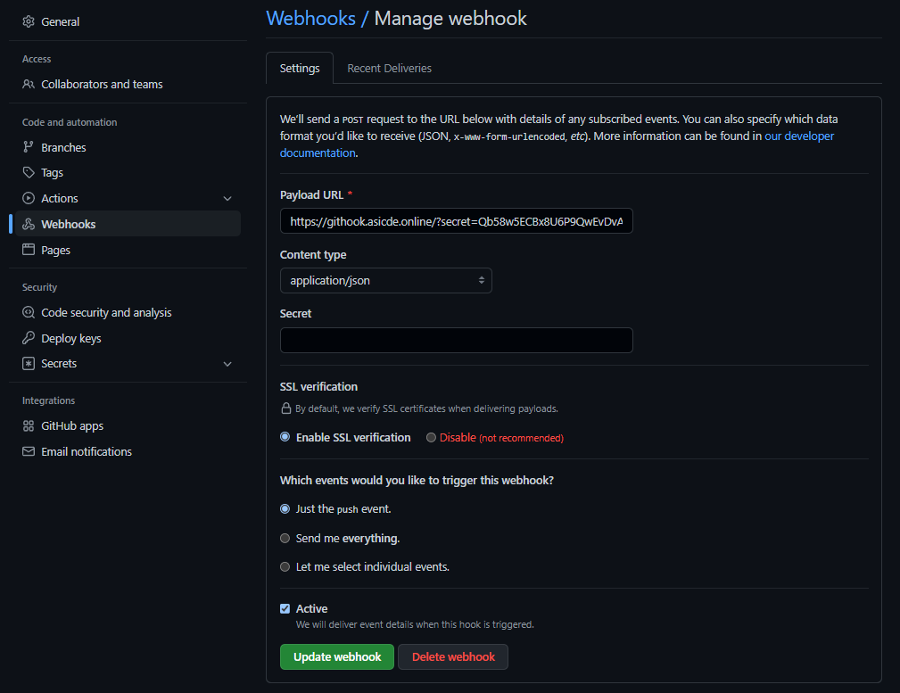

[<< Return to documentation overview](README.md)


# Server setup
[Old version](dev-stack-installation.md)

## 1. Preparation
- Configure SSH keys for you VM to enable remote access
- Download and install Putty (on Windows) SSH client

### Updating the Ubuntu installation

Connect to your Ubuntu VM and update the system

- `sudo su`
- `apt update`
- `apt upgrade -y`
- `do-release-upgrade`
  - Keep local versions of configs
  - Remove old packages
  - Reboot
  
### Installing required packages

We need to install some packages in order to be able to configure the development stack. A rundown of the packages is listed below:

- `git`: Commandline tool for git repository management
- *(Optional)* `mc`: Midnight commander - a visual interface for browsing through directory structures (with many useful features)
- `wget`: Commandline tool for downloading files
- `docker`: Service for Docker container deployment and management
- `docker-compose`: Commandline tool for working with Docker container stacks
- `nginx`: Web server and HTTP/HTTPS/WS/WSS proxy
- `php-fpm`: PHP file interpretter for integration with Nginx
- *(Optional)* `htop`: Utility to monitor system resources
- `zip` & `unzip`: Utilities for file compression and decompression

`apt install git mc wget htop zip unzip docker docker-compose nginx php-fpm`
  - Postifx configuration: Internet site
  

## 2. Setup your data disk

Your VM should come with a separate data disk. This disk isn't formatted or mounted by default.

To find out if you have an additional disk run `lsblk`:
```
NAME    MAJ:MIN RM  SIZE RO TYPE MOUNTPOINT
loop0     7:0    0 55.3M  1 loop /snap/core18/1885
loop1     7:1    0 70.6M  1 loop /snap/lxd/16922
loop2     7:2    0 30.3M  1 loop /snap/snapd/9279
vda     252:0    0   10G  0 disk
├─vda1  252:1    0  9.9G  0 part /
├─vda14 252:14   0    4M  0 part
└─vda15 252:15   0  106M  0 part /boot/efi
vdb     252:16   0   75G  0 disk
```
From the output above you can clearly see, that the VM has two disks, one named `vda` and the other named `vdb`. The first disk contains your Ubuntu installation and the second one is not formatted.

To set-up the second disk we first need to create a new partition table `cfdisk /dev/vdb`:
- Select partition scheme as `GPT`
- Select the Empty space and press New partition button
- Create a primary partition with the maximum size
- As partition type select `Linux`
- Press quit and save changes

The partition is now set-up but we still need to format it: `mkfs.ext4 /dev/vdb1`.

To auto-mount the partition create a new directory in the root of your filesystem `mkdir /data` and open fstab `vim /etc/fstab`:
```
# Data disk
/dev/vdb1                       /data                   ext4    defaults        0       0
```
Save the file and now you can mount the new disk to your VM with `mount -a`.

## 3. Setup Acme.sh for issuing Let's Encrypt certificates
Acme.sh script is used to generate SSL certificates for our web server.

- `curl https://get.acme.sh | sh`
- `cd /ubuntu/.acme.sh/`
- `mkdir /etc/nginx/certs`
- `mkdir /etc/nginx/certs/asicde.online`

```bash
./acme.sh --issue -d *.asicde.online -d asicde.online --dns --yes-I-know-dns-manual-mode-enough-go-ahead-please
```
Add TXT _acme-challenge record with displayed value to DNS records.

```bash
./acme.sh --issue -d *.asicde.online -d asicde.online --dns --yes-I-know-dns-manual-mode-enough-go-ahead-please --renew
```
Move certificate files to nginx.
```bash
sudo mv '/home/ubuntu/.acme.sh/*.asicde.online/fullchain.cer' '/etc/nginx/certs/asicde.online/fullchain.cer'
sudo mv '/home/ubuntu/.acme.sh/*.asicde.online/\*.asicde.online' '/etc/nginx/certs/asicde.online/key.key'
sudo service nginx restart
```

## 4. Setting up your webserver
- Create a new directory in /etc/nginx/ for custom configuration files: `mkdir /etc/nginx/conf`
- copy/make files like in server-setup/nginx folder
- `mkdir /data/logs`
- `chown www-data:www-data /data/logs`
- `chown -R root:www-data /etc/nginx/`
- `systemctl enable --now php7.4-fpm`
- `systemctl reload nginx`

## 5. Setup Portainer

Portainer is a tool for management of Docker containers and other components. It provides a web interface which is easy to navigate and user-friendly.
It will be important to cleanup old unused containers.

### Configure docker

First we need to stop Docker and change the storage location for Docker volumes. Stop Docker with `systemctl stop docker`.

Now create a new directory called `docker` in the `/data` directory and add the entry below into `/etc/fstab`:
```
# Docker data bind mount
/data/docker                    /var/lib/docker         none    bind            0       0
```

Refresh mounts with `mount -a` and start docker again `systemctl start docker`.

### Start Portainer

```bash
docker volume create portainer_data
docker run -d -p 9000:9000 \
              --name=portainer \
              --restart=always \
              -v /var/run/docker.sock:/var/run/docker.sock \
              -v portainer_data:/data portainer/portainer-ce
```

On first start, you will be asked to enter administrator user credentials and then select to use a local Docker server.

## 6. Setup Sonatype Nexus

Nexus is a portal for multiple package repositories including Maven repository, Docker registry and NPM repository. We will use this service to store our Maven artefacts, Docker images and cache downloaded packages in order to save some internet bandwidth.

To install Nexus, run the following command:
```bash
docker volume create --name nexus_data
docker run -d -p 8081:8081 \
              -p 8082:8082 \
              --name nexus \
              --restart unless-stopped \
              -v nexus_data:/nexus-data sonatype/nexus3
```
### Configure Nexus

During your first installation a password will be created for you which you can get with `docker exec -it nexus cat /nexus-data/admin.password`.

You will be asked to change your password and then enable anonymous access.

Setup repositories:

- NEW: docker (hosted)
  - Name: `asicde-docker`
  - Create HTTP connector on `8082`
  - Allow anonymous docker pull
- NEW: npm (proxy)
  - Name: `asicde-npm`
  - Remote storage: `https://registry.npmjs.org`
  - Use stored certificates
  - View certificate -> Add certificate to truststore

Setup reader user permission:

- Go to Security -> Roles
- Create role -> Nexus role
- Reader
  - Role ID: `reader`
  - Role name: `reader`
  - Add all `-read` and `-browse` permissions
- Jenkins
  - Role ID: `jenkins`
  - Role name: `jenkins`
  - Add permission `nx-repository-admin-*-*-add`
  - Add permission `nx-repository-admin-*-*-browse`
  - Add permission `nx-repository-admin-*-*-edit`
  - Add permission `nx-repository-admin-*-*-read`

Allow anonymous user to download files from repository:
- Security -> Users -> Anonymous user
- Add role `reader`

Create new user for Jenkins to use:
- Security -> Users -> Create user
- ID: `jenkins`
- First name: `Jenkins`
- Last name: `Jenkins`
- Email: `test@test.com`
- Status: `Active`
- Role: `jenkins`

## 7. Setup Jenkins

We will be running Jenkins in a Docker container. For this, we will need to create a custom container based on the original Jenkins image to be able to inject some other libraries and executables that are needed for building of Maven, NPM and Docker projects.

For this, let's create a workspace directory where we will store our configuration files `mkdir /opt/jenkins-docker`. In here we will create a Dockerfile for the app:

```dockerfile
# Get LTS version of Jenkins Docker image
FROM jenkins/jenkins:lts

# Switch to root user
USER root

# Update apt repositories
RUN apt -y update

# Download Docker and docker-compose
RUN cd /opt/; wget https://download.docker.com/linux/static/stable/x86_64/docker-19.03.13.tgz; tar xzvf docker-19.03.13.tgz; rm docker-19.03.13.tgz
RUN cd /opt/docker/; wget "https://github.com/docker/compose/releases/download/1.27.4/docker-compose-$(uname -s)-$(uname -m)" -O ./docker-compose; chmod +x ./docker-compose
ENV PATH="/opt/docker:${PATH}"

# Install JDK 13
COPY ./jdk-13.0.2_linux-x64_bin.deb /tmp/jdk-13.0.2_linux-x64_bin.deb
RUN apt -y install /tmp/jdk-13.0.2_linux-x64_bin.deb; rm -f /tmp/jdk-13.0.2_linux-x64_bin.deb
RUN update-alternatives --install /usr/bin/java java /usr/lib/jvm/jdk-13.0.2/bin/java 2
RUN update-alternatives --set java /usr/lib/jvm/jdk-13.0.2/bin/java
ENV JAVA_HOME /usr/lib/jvm/jdk-13.0.2/

# Download Maven
RUN cd /opt/; wget https://downloads.apache.org/maven/maven-3/3.6.3/binaries/apache-maven-3.6.3-bin.tar.gz; tar xzvf apache-maven-3.6.3-bin.tar.gz; rm apache-maven-3.6.3-bin.tar.gz
ENV PATH="/opt/apache-maven-3.6.3/bin:${PATH}"

USER jenkins
```

You also need to download [JDK 13 Debian installation package](https://www.oracle.com/java/technologies/javase-jdk13-downloads.html) and place it in the same folder (`/opt/jenkins-docker/jdk-13.0.2_linux-x64_bin.deb`).

Then build the image `docker build -t jenkins-docker .`.

Now we can create a Docker container that will run the Jenkins build service:
```bash
docker run -d -v /var/run/docker.sock:/var/run/docker.sock \
              -v jenkins_home:/var/jenkins_home \
              -p 8080:8080 \
              --name jenkins \
              --restart unless-stopped jenkins-docker
```

### Jenkins configuration

On first start a temporary password is generated for the Jenkins instance. You can get the password with the following command:
```bash
docker exec -it jenkins cat /var/jenkins_home/secrets/initialAdminPassword
```

Open a web browser, go to the Jenkins proxy URL and enter the password.

- Select option to automatically install suggested plugins
- Once the installation is finished, go to Manage Jenkins -> Manage Plugins
- Install the following additional plugins:
  - Docker
  - Docker Pipeline
  - File Operations
  - Maven Integration
  - Nexus Artifact Uploader
  - NodeJS
  - Pipeline NPM Integration
  - Pipeline Utility Steps
  - *(Optional)* Slack Notification

### Global tool configuration

#### JDK
- Add JDK
- Name: `jdk`
- Uncheck install automatically
- JAVA_HOME: `/usr/lib/jvm/jdk-13.0.2`

#### Maven
- Add Maven
- Name: `maven`
- Uncheck install automatically
- MAVEN_HOME: `/opt/apache-maven-3.6.3/`

#### NodeJS
- Add NodeJS
- Name: `nodejs`
- Install automatically
- Global NPM packages to install: `@angular/cli@9.1.5`

#### Docker
- Add Docker
- Name: `docker`
- Installation root: `/opt/docker`

### Maven configuration

Create a new m2.settings.xml file containing a basic Maven repository configuration:
```xml
<?xml version="1.0" encoding="UTF-8"?>
<settings xmlns="http://maven.apache.org/SETTINGS/1.1.0"
  xmlns:xsi="http://www.w3.org/2001/XMLSchema-instance"
  xsi:schemaLocation="http://maven.apache.org/SETTINGS/1.1.0 http://maven.apache.org/xsd/settings-1.1.0.xsd">

  <servers>
    <server>
      <id>{CREDENTIALS_ID}</id>
      <username>{USER}</username>
      <password>{PASSWORD}</password>
    </server>
  </servers>

  <mirrors>
    <mirror>
      <id>{CREDENTIALS_ID}</id>
      <name>{SERVER_NAME}</name>
      <url>{SERVER_URL}</url>
      <mirrorOf>*</mirrorOf>
    </mirror>
  </mirrors>

  <profiles>
    <profile>
      <id>{PROFILE_ID}</id>
      <repositories>
        <repository>
          <id>{CREDENTIALS_ID}</id>
          <url>{SERVER_URL}</url>
          <releases><enabled>true</enabled></releases>
          <snapshots><enabled>true</enabled></snapshots>
        </repository>
      </repositories>
     <pluginRepositories>
        <pluginRepository>
          <id>{CREDENTIALS_ID}</id>
          <url>{SERVER_URL}</url>
          <releases><enabled>true</enabled></releases>
          <snapshots><enabled>true</enabled></snapshots>
        </pluginRepository>
      </pluginRepositories>
    </profile>
  </profiles>
  <activeProfiles>
    <activeProfile>{PROFILE_ID}</activeProfile>
  </activeProfiles>

</settings>
```

Fill the information based on the previous step for Configuring Nexus.

- **{CREDENTIALS_ID}**: name for your credentials, e.g. `credentials`
- **{USER}**: Nexus server username, e.g. `jenkins`
- **{PASSWORD}**: Nexus server password, e.g. `supersecret`
- **{SERVER_NAME}**: name for your server, e.g. `nexus`
- **{SERVER_URL}**: Nexus Maven repository URL, e.g. `https://nexus.asicde.org/repository/maven-group/`
- **{PROFILE_ID}**: name for profile, e.g. `asicde`

Then copy this file into the Jenkins container:
```bash
docker exec -it jenkins mkdir -p /var/jenkins_home/.m2/
docker cp ./m2.settings.xml jenkins:/var/jenkins_home/.m2/settings.xml
```

### NPM configuration

Create .npmrc file containing configuration for default NPM repository:
```
registry={REPO_URL}
_auth={CREDENTIALS}
```

Fill the information based on the previous step for Configuring Nexus.

- **{REPO_URL}**: Nexus NPM repository URL, e.g. `https://nexus.asicde.org/repository/asicde-npm/`
- **{CREDENTIALS}**: credentials for Nexus (`username:password` encoded with base64), e.g. `bmljZTp0cnkK`

Then copy this file into the Jenkins container:
```bash
docker cp ./.npmrc jenkins:/var/jenkins_home/.npmrc
```

### Setting up credentials

Go to Manage Jenkins -> Manage credentials -> Jenkins -> Global credentials

#### Github SSH access

- Type: SSH username with private key
- ID: `github`
- Username: `git`
- Private key -> Enter directly

#### Nexus access

- Type: Username with password
- ID: `nexus`
- Username: `jenkins`
- Password: `supersecret`

#### *(Optional)* Slack access

- Type: Secret text
- ID: `slack`
- Secret: `somesecrettoken`

## 8. Setup Jenkins pipelines

Add pipelines to Jenkins, click on New item -> Type in name -> Select Pipeline project type -> Create. 

All pipeline we used are in server-setup/JENKINS directory. Add them all.


First build them in order
- ASICDE-dev-parent 
- ASICDE-dev-api
- ASICDE-collab
- ASICDE-chat
- ASICDE-router
- asicde-simulator
- asicde-simulator-api
- ASICDE-dev-backend -- will throw error beacuse it trigger ASICDE-deploy-dev before ASICDE-dev-frontend is builded, its ok
- ASICDE-dev-frontend

### ASICDE-custom-router
Is used for local developement.
### tp-website
Is used for team website. Just change repository url for yours. And add Dockerfile for container build.
```
FROM nginx:1.19-alpine
RUN rm -rf /etc/nginx/conf.d/*
COPY nginx.conf /etc/nginx/conf.d/00-default.conf
COPY ./ /usr/share/nginx/html
```


## 9. Githook
Move server-setup/githook directory to /data/githook. Subdomain githook.asicde.online is linked to this directory (see /etc/nginx/sites-available/asicde.online/proxy.githook.conf ).
Add webhook to repository you want to watch.

You can define new token in /data/githook/index.php so ad what branch you want to listen.
You have to set this token also in jenkins pipeline.
